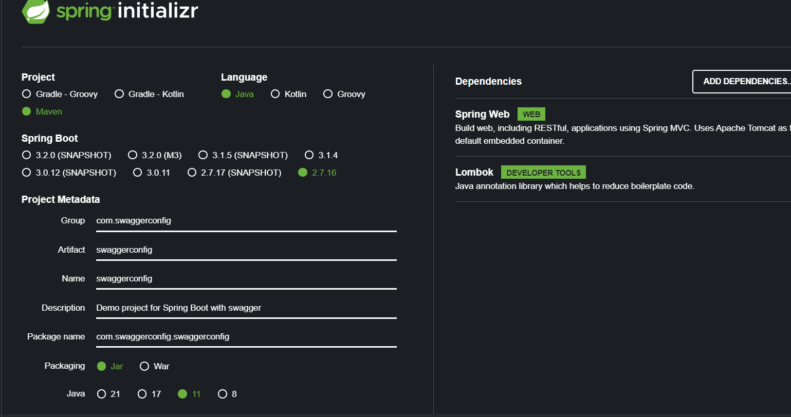

# Swagger 2 → SpringBoot 2



Si es un proyecto de 0 podemos crearlos en [https://start.spring.io](https://start.spring.io/)

Con las siguientes dependencias:

- Spring Web
- Lombok (opcional)
- ### Configuración del Swagger

  Agregamos la dependencia de Swagger manual en el POM.XML

    ```xml
    	<dependency>
    		<groupId>io.springfox</groupId>
    		<artifactId>springfox-boot-starter</artifactId>
    		<version>3.0.0</version>
    	</dependency>
    ```

  Ahora agregar una clase de configuración para el swagger con al anotación **@Configure**:

    ```java
    @Configuration
    public class SwaggerConfig {
    }
    ```

  Ahora agregamos la configuración en la clase recién creada con la **versión 2**:

    ```java
    @Bean
        public Docket api(){
            return new Docket(DocumentationType.SWAGGER_2)
                    .useDefaultResponseMessages(false)
                    .apiInfo(this.getApiInfo())
                    .select()
                    .apis(RequestHandlerSelectors.withClassAnnotation(RestController.class))
                    //.apis(RequestHandlerSelectors.any()) //Asi se muestran todos los controller
                    ///.apis(RequestHandlerSelectors.basePackage("com.devs4j.Rest.Controller"))//se pone el paquete a exponer
                    //.paths(PathSelectors.any())// asi se muestran todas las operaciones
                    // .paths(PathSelectors.ant("/users/*")) // se espesifica el cotroller a exponer
                    .paths(PathSelectors.any())// asi se muestran todas las operaciones
                    .build();
    
        }
    
        private ApiInfo getApiInfo() {
            // TODO Auto-generated method stub
            return new ApiInfoBuilder()
                    .title("Spring 2 | Swagger 2")
                    .description("Sin spring-boot-actuator-autoconfigure ")
                    .version("1.0")
                    //.license("La licenica")
                    //.contact(new Contact("Erwin","www.pagina.com", "correo@coore.com"))
                    .build();
        }
    ```

  Ya ahora agregamos al archivo **application** (yml/properties) lo siguiente:

    ```yaml
    spring:
      mvc:
        pathmatch:
          matching-strategy: ant_path_matcher
    ```

URL:
localhost:8080/swagger-ui/